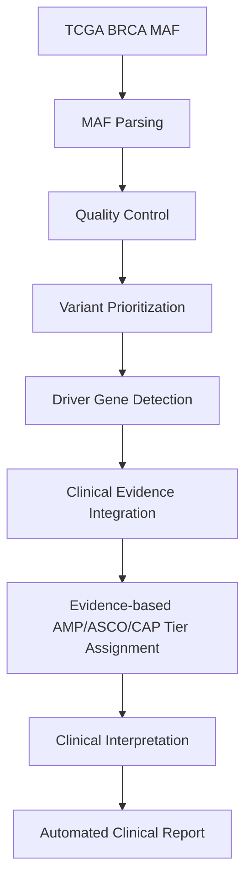
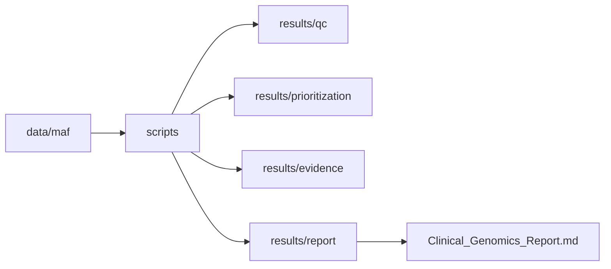
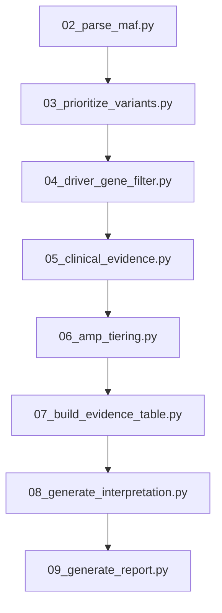

# Clinical Cancer Genomics Pipeline

## Workflow



## Project Architecture



## Pipeline



##  Directory Structure 


```text

Clinical_Cancer_Genomics_Pipeline/

├── data/

├── database/

├── figures/

├── reports/

├── results/

├── scripts/

├── README.md

└── run_pipeline.sh

``` 


```text

Clinical_Cancer_Genomics_Pipeline/

│

├── README.md                      # Project documentation

├── LICENSE                        # MIT License

├── environment.yml                # Conda environment

├── requirements.txt               # Python dependencies

├── run_pipeline.sh                # Execute complete analysis pipeline

│

├── data/

│   ├── raw/                       # Raw downloaded datasets

│   ├── maf/                       # TCGA/GDC somatic mutation MAF files

│   ├── clinical/                  # Clinical metadata

│   ├── vcf/                       # Variant Call Format files

│   ├── annotated/                 # Annotated variants

│   └── filtered/                  # Filtered datasets

│

├── database/

│   ├── clinvar/                   # ClinVar annotations

│   ├── cosmic/                    # COSMIC mutation data

│   ├── civic/                     # CIViC evidence

│   ├── gnomad/                    # Population frequencies

│   └── oncokb/                    # OncoKB annotations

│

├── gene_panels/

│   └── cancer_driver_genes.txt    # Curated cancer driver genes

│

├── scripts/

│   ├── 01_download_mc3_maf.R

│   ├── 02_parse_maf.py

│   ├── 03_prioritize_variants.py

│   ├── 04_driver_gene_filter.py

│   ├── 05_clinical_evidence.py

│   ├── 06_amp_tiering.py

│   ├── 07_build_evidence_table.py

│   ├── 08_generate_interpretation.py

│   └── 09_generate_report.py

│

├── results/

│   ├── qc/                        # Quality control summaries

│   ├── prioritization/            # Prioritized variants

│   ├── evidence/                  # Clinical evidence tables

│   ├── amp/                       # AMP tier assignments

│   └── report/                    # Interpretation outputs

│

├── reports/

│   └── final/

│       └── Clinical_Genomics_Report.md

│

├── figures/

│   ├── workflow.png

│   ├── project_architecture.png

│   ├── qc_summary.png

│   ├── driver_variants.png

│   ├── report_preview.png

│   └── igv/

│

├── docs/

│   ├── Methodology.md

│   └── IGV_Workflow.md

│

├── notebooks/                     # Exploratory analyses

│

└── patient/                       # Example patient metadata

```

## 📊 Example Results

### Dataset

| Parameter | Value |
|------------|-------|
| Dataset | TCGA Breast Cancer (TCGA-BRCA) |
| Data Type | Open-access Masked Somatic Mutation (MAF) |
| Sample Type | Primary Breast Tumor |
| Source | TCGA / GDC |

### Quality Control Summary

| Metric | Result |
|---------|-------:|
| Variants Analysed | 48 |
| Genes Affected | 48 |
| SNPs | 47 |
| Deletions | 1 |
| Driver Genes Identified | TP53, PIK3CA |

### Variant Classification

| Classification | Count |
|---------------|------:|
| Missense Mutation | 31 |
| Silent | 10 |
| Nonsense Mutation | 3 |
| RNA | 2 |
| Frame Shift Deletion | 1 |
| Splice Site | 1 |

### Variant Type

| Type | Count |
|------|------:|
| SNP | 47 |
| DEL | 1 |

### Predicted Functional Impact

| Impact | Count |
|--------|------:|
| MODERATE | 31 |
| LOW | 10 |
| HIGH | 5 |
| MODIFIER | 2 |

### Driver Variants Prioritized

| Gene | Protein Change | Classification | Predicted Impact |
|------|----------------|----------------|-----------------|
| TP53 | p.Q331* | Nonsense Mutation | HIGH |
| PIK3CA | p.E1037K | Missense Mutation | MODERATE |

### Clinical Evidence Resources

- COSMIC
- ClinVar
- CIViC

### Generated Outputs

- Quality control summaries
- Variant prioritization tables
- Driver gene identification
- Clinical evidence integration
- Educational AMP/ASCO/CAP tier assignments
- Clinical interpretation report

---

> **Note**
>
> This project uses publicly available TCGA data for educational and research purposes.
> The generated interpretations are demonstration outputs and are **not intended for clinical diagnosis or patient management**.
>
---

## ⚠️ Limitations

| Aspect | Description |
|--------|-------------|
| Dataset | Demonstration pipeline developed using publicly available TCGA breast cancer data. |
| Clinical Use | Intended for educational and research purposes only; not validated for clinical decision-making. |
| Evidence Sources | Clinical evidence integration is based on publicly available resources and simplified educational rules. |
| Variant Scope | Focuses on somatic SNVs and small indels from MAF files; structural variants, CNVs, and gene fusions are not currently included. |
| Interpretation | AMP/ASCO/CAP tier assignments are demonstration implementations and do not replace expert molecular pathology review. |
| Patient Data | No patient-identifiable or protected health information (PHI) is used. |

---

## 🚀 Future Work

| Planned Feature | Objective |
|----------------|-----------|
| OncoKB Integration | Incorporate therapeutic evidence from OncoKB to improve clinical interpretation. |
| CIViC API Integration | Retrieve up-to-date clinical evidence directly from CIViC. |
| ClinVar API Integration | Automatically obtain the latest clinical significance annotations. |
| IGV Review Module | Generate IGV screenshots and document manual variant review workflow. |
| Multi-Sample Cohort Analysis | Support simultaneous analysis of multiple tumor samples. |
| CNV & Structural Variant Support | Extend the pipeline to copy number alterations and structural variants. |
| Gene Fusion Detection | Integrate RNA-seq fusion analysis for clinically relevant oncogenic fusions. |
| Containerization | Package the complete workflow using Docker for reproducible execution. |
| Workflow Automation | Implement Snakemake/Nextflow for scalable and reproducible pipeline execution. |
| Interactive Reporting | Develop an HTML dashboard summarizing variant prioritization and clinical evidence. |
