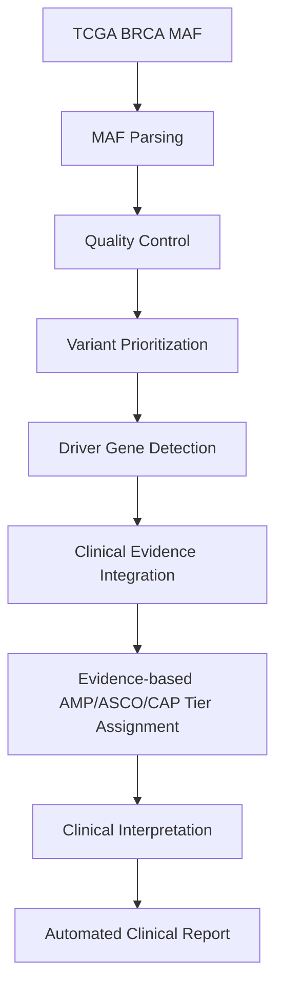
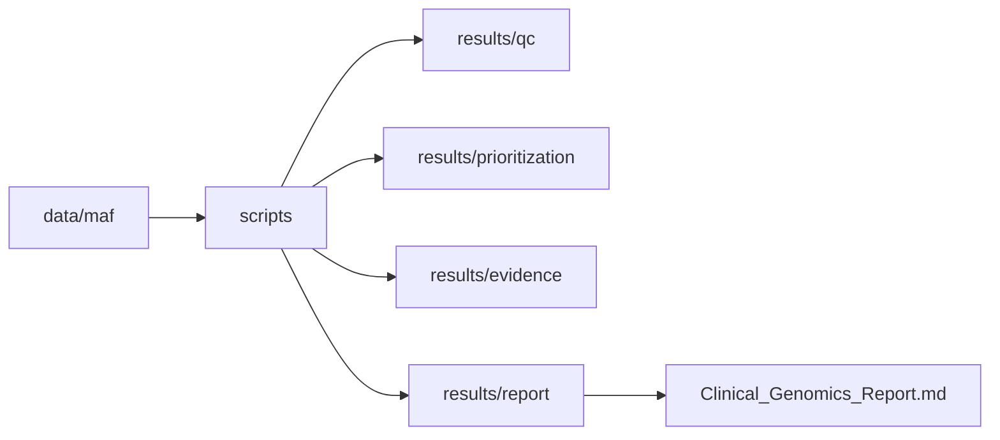
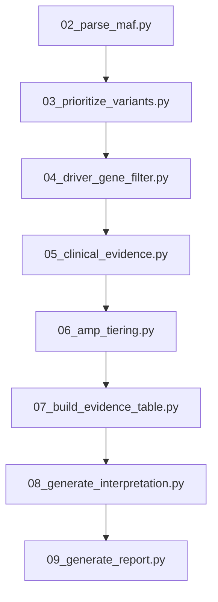

# Clinical Cancer Genomics Pipeline

## Workflow



## Project Architecture



## Pipeline



##  Directory Structure 


```text

Clinical_Cancer_Genomics_Pipeline/

├── data/

├── database/

├── figures/

├── reports/

├── results/

├── scripts/

├── README.md

└── run_pipeline.sh

``` 


```text

Clinical_Cancer_Genomics_Pipeline/

│

├── README.md                      # Project documentation

├── LICENSE                        # MIT License

├── environment.yml                # Conda environment

├── requirements.txt               # Python dependencies

├── run_pipeline.sh                # Execute complete analysis pipeline

│

├── data/

│   ├── raw/                       # Raw downloaded datasets

│   ├── maf/                       # TCGA/GDC somatic mutation MAF files

│   ├── clinical/                  # Clinical metadata

│   ├── vcf/                       # Variant Call Format files

│   ├── annotated/                 # Annotated variants

│   └── filtered/                  # Filtered datasets

│

├── database/

│   ├── clinvar/                   # ClinVar annotations

│   ├── cosmic/                    # COSMIC mutation data

│   ├── civic/                     # CIViC evidence

│   ├── gnomad/                    # Population frequencies

│   └── oncokb/                    # OncoKB annotations

│

├── gene_panels/

│   └── cancer_driver_genes.txt    # Curated cancer driver genes

│

├── scripts/

│   ├── 01_download_mc3_maf.R

│   ├── 02_parse_maf.py

│   ├── 03_prioritize_variants.py

│   ├── 04_driver_gene_filter.py

│   ├── 05_clinical_evidence.py

│   ├── 06_amp_tiering.py

│   ├── 07_build_evidence_table.py

│   ├── 08_generate_interpretation.py

│   └── 09_generate_report.py

│

├── results/

│   ├── qc/                        # Quality control summaries

│   ├── prioritization/            # Prioritized variants

│   ├── evidence/                  # Clinical evidence tables

│   ├── amp/                       # AMP tier assignments

│   └── report/                    # Interpretation outputs

│

├── reports/

│   └── final/

│       └── Clinical_Genomics_Report.md

│

├── figures/

│   ├── workflow.png

│   ├── project_architecture.png

│   ├── qc_summary.png

│   ├── driver_variants.png

│   ├── report_preview.png

│   └── igv/

│

├── docs/

│   ├── Methodology.md

│   └── IGV_Workflow.md

│

├── notebooks/                     # Exploratory analyses

│

└── patient/                       # Example patient metadata

```

## Example Results

Dataset
• TCGA Breast Cancer (TCGA-BRCA)

QC Summary
• Variants analysed: 48
• Genes affected: 48
• SNPs: 47
• Deletions: 1

Driver Genes Identified
• TP53
• PIK3CA

Clinical Evidence Sources
• COSMIC
• ClinVar
• CIViC

Generated Outputs
• QC summaries
• Driver gene table
• AMP tier assignments
• Clinical interpretation report

Limitations

• Demonstration pipeline using public TCGA data.
• AMP classifications are educational examples.
• No patient-identifiable information.
• Not intended for clinical decision making.

Future Work

• Integrate OncoKB API
• Add IGV screenshot generation
• Support multi-sample cohorts
• Incorporate CNV and fusion analysis
• Containerize with Docker

